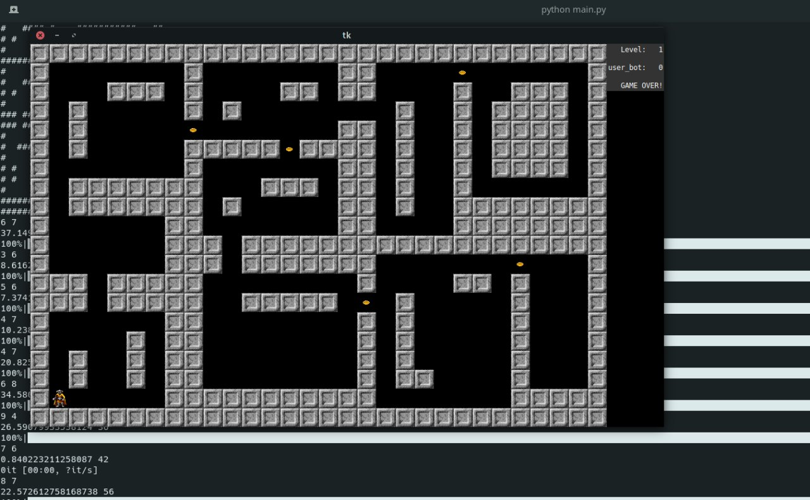
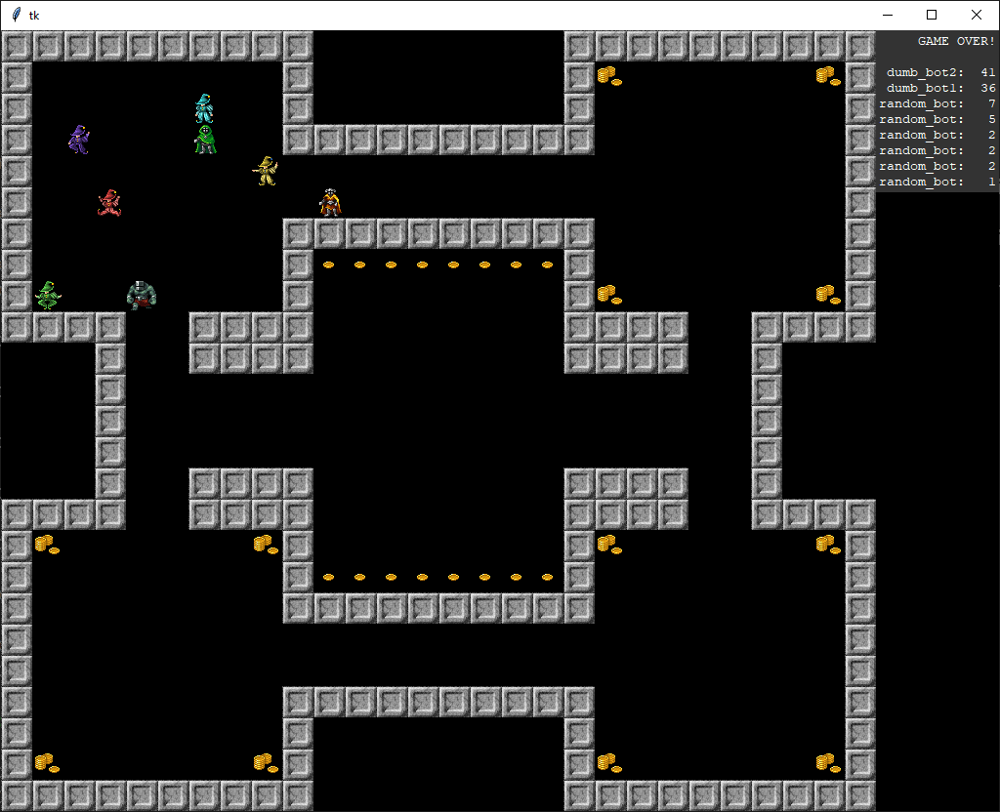

# DandyBot

А simple programming game. You write Python scripts to control your bot in a roguelike (or [Dandy](https://en.wikipedia.org/wiki/Dandy_(video_game))-like) world. The goal is to collect as much gold as possible in the presence of other bots.

The game uses only the Python standard library. Graphics assets are from [here](https://opengameart.org/content/dungeon-crawl-32x32-tiles-supplemental).

See [random_bot.py](random_bot.py) and [user_bot.py](user_bot.py) for API examples.

## Procedural generation based on BSP tree realiasation from [here](https://arcade.academy/examples/procedural_caves_bsp.html)

Rooms generation is based on [random walker algorithm](https://ru.wikipedia.org/wiki/%D0%A1%D0%BB%D1%83%D1%87%D0%B0%D0%B9%D0%BD%D0%BE%D0%B5_%D0%B1%D0%BB%D1%83%D0%B6%D0%B4%D0%B0%D0%BD%D0%B8%D0%B5)

## Some hints

1. You may check for "wall", "gold" and "player" at the specified position.
2. Check for the current level number, but try to generalize your code.
3. Do not use any global data or state.

